# Micro-services E-Commerce avec Spring Cloud, Keycloak et Angular

> Projet pédagogique illustrant la mise en œuvre d'une architecture micro-services synchrone, sécurisée et dotée d'un frontend Angular, en s'appuyant sur l'écosystème **Spring Cloud**, **Keycloak** et **Angular 21**.

> **Pattern illustré :** Microservices synchrones avec Circuit Breaker, configuration centralisée, Service Discovery et gestion des identités via Keycloak.
> Pour une version asynchrone orientée événements avec Kafka, voir le projet PFE lié.

---

## Table des matières

1. [Vue d'ensemble](#1-vue-densemble)
2. [Architecture Technique](#2-architecture-technique)
3. [Décisions d'Architecture](#3-décisions-darchitecture)
4. [Stack Technologique](#4-stack-technologique)
5. [Prérequis et Démarrage](#5-prérequis-et-démarrage)
6. [Gestion des Identités et des Accès — Keycloak](#6-gestion-des-identités-et-des-accès--keycloak)
7. [Validation et Tests](#7-validation-et-tests)
8. [Sécurisation des Micro-services](#8-sécurisation-des-micro-services)
9. [Frontend Angular](#9-frontend-angular)
10. [Prochaines Étapes : RBAC et Évolutions](#10-prochaines-étapes--rbac-et-évolutions)
11. [Retours d'Expérience (Lessons Learned)](#11-retours-dexpérience-lessons-learned)

---

## 1. Vue d'ensemble

Ce projet met en œuvre une architecture **micro-services synchrone** pour une application e-commerce simplifiée. Les services communiquent entre eux via **OpenFeign** (appels HTTP synchrones), et la résilience est assurée par **Resilience4j** (Circuit Breaker, Retry, TimeLimiter).

La configuration externalisée de tous les services est hébergée dans un dépôt Git dédié :
[spring-cloud-synchronous-microservices-config-repo](https://github.com/devsahamerlin/spring-cloud-synchronous-microservices-config-repo)

### Flux global

```
Navigateur / Client HTTP
        │
        ▼
  [Gateway Service :8888]   ← Point d'entrée unique (authentification JWT + CORS centralisé)
        │
        ├──► [Customer Service :8081]   ← Données clients
        ├──► [Inventory Service :8082]  ← Catalogue produits
        └──► [Billing Service :8083]    ← Factures (orchestre Customer + Inventory)

  [Discovery Service :8761]   ← Registre Eureka (tous les services s'y enregistrent)
  [Config Service :9999]      ← Serveur de configuration centralisée
  [Keycloak :9997]            ← Serveur d'autorisation OAuth2/OIDC
```

---

## 2. Architecture Technique

### Description des services

| Service               | Port  | Rôle                                                                                      |
|-----------------------|-------|-------------------------------------------------------------------------------------------|
| `config-service`      | 9999  | Distribue les fichiers de configuration à tous les micro-services via un dépôt Git        |
| `discovery-service`   | 8761  | Registre Eureka : enregistrement et découverte dynamique des instances                    |
| `gateway-service`     | 8888  | Point d'entrée unique : routage, équilibrage de charge, validation des tokens JWT         |
| `customer-service`    | 8081  | CRUD clients, exposé via la Gateway, protégé par OAuth2 Resource Server                  |
| `inventory-service`   | 8082  | CRUD produits, exposé via la Gateway, protégé par OAuth2 Resource Server                 |
| `billing-service`     | 8083  | Orchestrateur : consolide les factures en appelant Customer et Inventory via OpenFeign    |

### Dépendances inter-services

```
billing-service
    ├── → customer-service   (via OpenFeign + Circuit Breaker)
    └── → inventory-service  (via OpenFeign, sans circuit breaker — illustre l'absence de protection)
```

Le `billing-service` joue le rôle d'**agrégateur** : pour construire une facture complète, il appelle synchroniquement les deux autres services métiers. En cas d'indisponibilité du `customer-service`, le Circuit Breaker de Resilience4j renvoie une réponse de repli (*fallback*) pour maintenir la disponibilité.

---

## 3. Décisions d'Architecture

> Cette section documente les **choix de conception**, leurs justifications et leurs compromis (*trade-offs*). Un code qui fonctionne sans documentation des choix ne vaut que pour aujourd'hui ; un README qui explique le *pourquoi* vaut pour l'équipe entière.

---

### 3.1 Pourquoi synchrone (OpenFeign) et pas asynchrone (Kafka) ?

Ce projet illustre **volontairement** la communication synchrone pour mettre en évidence ses limites — notamment la **cascade de pannes** (*cascading failure*) que Resilience4j vient mitiger.

| Aspect                | Synchrone (OpenFeign)                         | Asynchrone (Kafka)                                  |
|-----------------------|-----------------------------------------------|-----------------------------------------------------|
| Complexité initiale   | Faible — appel HTTP direct                    | Élevée — schéma d'événements, consumers, topics     |
| Couplage temporel     | Fort — l'appelant attend la réponse           | Faible — le producteur n'attend pas                 |
| Résilience            | Nécessite Circuit Breaker explicite (Resilience4j) | Structurellement résilient (retry, DLQ)        |
| Observabilité         | Simple (logs HTTP)                            | Nécessite un broker de suivi (Kafka UI, etc.)       |
| Cas d'usage idéal     | Lecture en temps réel, agrégation de données  | Commandes, notifications, pipelines d'événements   |

**Conclusion :** OpenFeign est le bon choix pour un projet pédagogique illustrant les patterns de résilience. Une architecture Kafka éliminerait le problème de cascade *structurellement*, mais masquerait la nécessité du Circuit Breaker.

---

### 3.2 Pourquoi Keycloak plutôt qu'un système d'authentification maison ?

- **Zero-trust par défaut** : aucune gestion de mots de passe, sessions ou tokens à implémenter.
- **Standards OAuth2 / OIDC** : interopérabilité garantie, tokens JWT standardisés.
- **Pas de dette sécurité** : les failles connues sont corrigées dans les mises à jour Keycloak, sans toucher au code applicatif.
- **Fonctionnalités avancées incluses** : MFA, fédération d'identité, gestion des rôles et scopes, auto-inscription.

> **Trade-off documenté :** Le `config-service` n'est **pas** sécurisé par Keycloak. Ce choix est délibéré — les autres services contactent le Config Server dès leur démarrage, avant même d'avoir obtenu un token. Sécuriser ce service créerait une **dépendance circulaire** impossible à résoudre au boot. C'est un compromis assumé : le Config Server doit rester accessible dans le réseau interne de confiance uniquement.

---

### 3.3 Pourquoi H2 en développement ?

- **Réduire la friction à l'onboarding** : aucune installation de base de données requise pour lancer le projet.
- **Tests rapides** : base de données en mémoire, recréée à chaque démarrage.
- La migration vers **PostgreSQL en production** est un simple remplacement de driver JDBC et de configuration — l'architecture applicative ne change pas.

---

### 3.4 Pourquoi centraliser le CORS dans la Gateway ?

Dans une architecture avec API Gateway, le navigateur communique **uniquement avec la Gateway** (port `8888`). Les services en aval (`billing-service`, etc.) ne sont jamais appelés directement depuis le navigateur — ils n'ont donc aucune raison de gérer le CORS.

Si les services en aval définissent également leurs propres règles CORS, le header `Access-Control-Allow-Origin` est envoyé **deux fois** dans la réponse HTTP, ce qui est interdit par la spécification CORS et rejette la requête côté navigateur — même si le statut HTTP est `200 OK`.

#### Analyse du bug — Double header `Access-Control-Allow-Origin`

Le symptôme est particulièrement **contre-intuitif** : la requête HTTP retourne un statut `200 OK`, les données sont bien présentes côté serveur, mais le navigateur bloque quand même la réponse avec une erreur CORS. L'onglet "Preview" des DevTools est vide.

```
CORS error — bills — xhr — billing.ts:21
Status Code: 200 OK  ← la requête aboutit côté serveur
access-control-allow-origin: http://localhost:4200   ← ajouté par la Gateway
access-control-allow-origin: http://localhost:4200   ← ajouté en double par le service en aval
```

**Cause :** si les services en aval (`billing-service`, `customer-service`, `inventory-service`) définissent également leurs propres règles CORS, le navigateur reçoit l'en-tête `Access-Control-Allow-Origin` **en double**. La spécification CORS interdit les valeurs multiples pour cet en-tête — le navigateur rejette la réponse même si chaque valeur individuellement est correcte.

**Pourquoi Postman n'est pas affecté ?** Postman est un client HTTP, pas un navigateur. Il n'implémente pas la politique de même origine (Same-Origin Policy) et ignore entièrement les en-têtes CORS. Un test réussi dans Postman **ne garantit pas** le bon fonctionnement depuis un navigateur.

**Solution appliquée : `cors.disable()` dans la `SecurityConfig` de chaque service en aval, et gestion CORS centralisée dans la Gateway uniquement.**

```java
// billing-service / customer-service / inventory-service — SecurityConfig.java
http
    .cors(cors -> cors.disable())  // CORS géré exclusivement par la Gateway
    ...
```

```java
// gateway-service — SecurityConfig.java
@Bean
public CorsConfigurationSource corsConfigurationSource() {
    CorsConfiguration config = new CorsConfiguration();
    config.setAllowedOrigins(List.of("http://localhost:4200"));
    config.setAllowedMethods(List.of("GET", "POST", "PUT", "DELETE", "OPTIONS", "PATCH"));
    config.setAllowedHeaders(List.of("*"));
    config.setAllowCredentials(true);
    config.setMaxAge(3600L);
    UrlBasedCorsConfigurationSource source = new UrlBasedCorsConfigurationSource();
    source.registerCorsConfiguration("/**", config);
    return source;
}
```

---

## 4. Stack Technologique

| Catégorie          | Technologie                                         | Version         |
|--------------------|-----------------------------------------------------|-----------------|
| Langage            | Java                                                | 21              |
| Framework          | Spring Boot                                         | 3.5.7           |
| Spring Cloud       | Spring Cloud (Config, Gateway, Eureka, OpenFeign)   | 2025.0.0        |
| Résilience         | Resilience4j (Circuit Breaker, Retry, TimeLimiter)  | intégré à Boot  |
| Sécurité           | Spring Security OAuth2 Resource Server + Keycloak   | 26.1.4          |
| Build              | Maven                                               | wrapper inclus  |
| Frontend           | Angular + TailwindCSS                               | 21 / 4.x        |
| Auth Frontend      | keycloak-angular                                    | 21.0.0          |
| Conteneurisation   | Docker + Docker Compose                             | —               |
| Base de données    | H2 (en mémoire, pour le développement)             | —               |

---

## 5. Prérequis et Démarrage

### Prérequis

- **Java 21** (JDK)
- **Maven 3.9+** (ou utiliser le wrapper `./mvnw` inclus)
- **Docker** et **Docker Compose**
- **Node.js 20+** et **npm 10+** (pour le frontend Angular)
- **Angular CLI 21** (`npm install -g @angular/cli`)

### Ordre de démarrage recommandé

Les services ont des dépendances au démarrage. Le respect de l'ordre suivant est **obligatoire** :

```
1. Keycloak          (via Docker Compose) — doit être prêt avant les services qui valident les tokens
2. config-service    — doit être prêt avant tous les autres services Spring Boot
3. discovery-service — registre Eureka, doit être disponible avant les services métiers
4. customer-service
5. inventory-service
6. billing-service   — dépend de customer-service et inventory-service via OpenFeign
7. gateway-service   — doit démarrer en dernier (routes vers tous les services en aval)
8. ecom-frontend     — démarre après que la Gateway est opérationnelle
```

> ⚠️ **Erreur fréquente :** démarrer `billing-service` avant que `customer-service` ou `inventory-service` soit enregistré dans Eureka provoque des erreurs OpenFeign au premier appel. Attendre que les services apparaissent dans le tableau de bord Eureka (`http://localhost:8761`) avant de tester.

### Lancement de l'infrastructure (Keycloak + PostgreSQL)

```shell
cd infra
docker-compose -f common.yml -f keycloak.yml up -d
```

Keycloak sera accessible sur `http://localhost:9997`.

> ⚠️ **Important :** après toute modification des variables d'environnement Keycloak (ex. `KC_HOSTNAME`, `KC_PROXY_HEADERS`), un **redémarrage complet du conteneur** est obligatoire — un simple `docker-compose restart` ne recharge pas les variables d'environnement. Utiliser `docker-compose down && docker-compose up -d`.

### Lancement des micro-services Spring Boot

Depuis la racine de chaque module (ou via votre IDE) :

```shell
# Exemple pour billing-service
cd billing-service
./mvnw spring-boot:run
```

### Lancement du frontend Angular

```shell
cd ecom-frontend
npm install
ng serve
```

Application disponible sur `http://localhost:4200`.

---

## 6. Gestion des Identités et des Accès — Keycloak

La sécurisation est entièrement déléguée à **Keycloak**, qui joue le rôle de serveur d'autorisation **OAuth2 / OIDC**. Les micro-services Spring Boot configurés en mode *Resource Server* valident les tokens JWT émis par Keycloak sans stocker aucun état de session (*stateless*).

> La procédure complète de configuration Keycloak (Realm, Clients, Rôles, Utilisateurs) est documentée ici : **[Guide de mise en œuvre Keycloak](infra/README.md)**

### Configuration OAuth2 Resource Server (Spring Boot)

Chaque service sécurisé déclare l'URI du serveur Keycloak dans son `application.properties` :

```properties
spring.security.oauth2.resourceserver.jwt.issuer-uri=http://localhost:9997/realms/ecom-ms-realm
spring.security.oauth2.resourceserver.jwt.jwk-set-uri=http://localhost:9997/realms/ecom-ms-realm/protocol/openid-connect/certs
```

Le filtre de sécurité valide ensuite chaque requête entrante en vérifiant la signature JWT et en extrayant les rôles depuis le claim `roles` :

```java
@Bean
public JwtAuthenticationConverter jwtAuthenticationConverter() {
    JwtGrantedAuthoritiesConverter converter = new JwtGrantedAuthoritiesConverter();
    converter.setAuthoritiesClaimName("roles");
    converter.setAuthorityPrefix("ROLE_");
    JwtAuthenticationConverter jwtConverter = new JwtAuthenticationConverter();
    jwtConverter.setJwtGrantedAuthoritiesConverter(converter);
    return jwtConverter;
}
```

### Flux d'obtention d'un token (Client Credentials)

```
Client → POST http://localhost:9997/realms/ecom-ms-realm/protocol/openid-connect/token
         Body: grant_type=client_credentials&client_id=...&client_secret=...
         ↓
       Access Token JWT
         ↓
Client → GET http://localhost:8888/BILLING-SERVICE/api/bills
         Header: Authorization: Bearer <access_token>
```

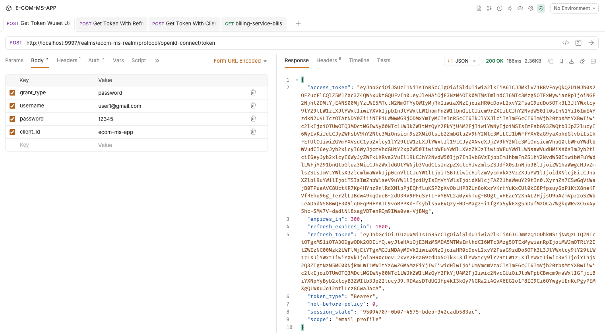

---

## 7. Validation et Tests

### 7.1 Service de Découverte (Eureka)

Tableau de bord Eureka accessible sur `http://localhost:8761`. Il affiche les instances enregistrées en temps réel.


---

### 7.2 Configuration Centralisée

Le `config-service` (port `9999`) sert les fichiers de configuration depuis le dépôt Git distant. Validation des profils :

*Billing Service — profil Production*
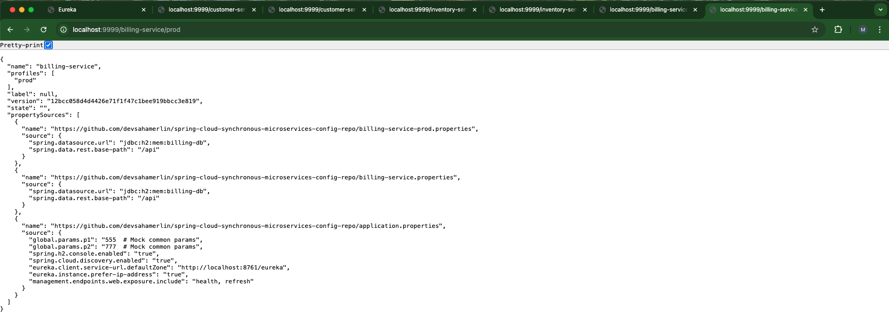

*Customer Service — profil Production*
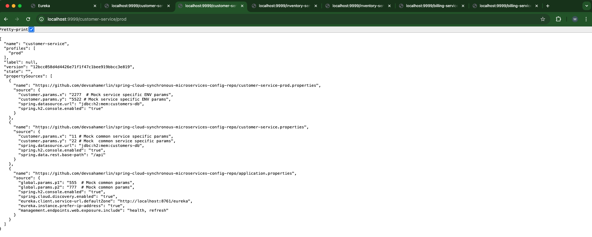

*Inventory Service — profil Développement*
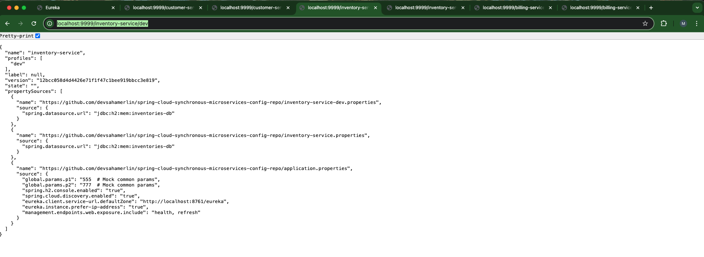

---

### 7.3 Accès aux Services via l'API Gateway

Tous les services métiers sont exposés **uniquement** via la passerelle `http://localhost:8888`. L'accès direct aux ports internes n'est pas nécessaire.

| Service           | URL via Gateway                                    |
|-------------------|----------------------------------------------------|
| Customer Service  | `http://localhost:8888/CUSTOMER-SERVICE/customers` |
| Inventory Service | `http://localhost:8888/INVENTORY-SERVICE/products` |
| Billing Service   | `http://localhost:8888/BILLING-SERVICE/api/bills`  |

*Customer Service*


*Inventory Service*


*Billing Service — liste des factures*


---

### 7.4 Mécanismes de Résilience (Resilience4j)

Le `billing-service` intègre des patterns de résilience pour gérer les défaillances de ses dépendances.

**Circuit Breaker actif — Customer Service indisponible :**
Lorsque le `customer-service` est arrêté, le Circuit Breaker s'ouvre et renvoie une réponse de repli (*fallback*) au lieu de propager l'erreur.


**Sans Circuit Breaker — Inventory Service indisponible :**
Sans mécanisme de protection sur l'appel à `inventory-service`, l'erreur remonte directement au client — ce cas est **délibérément non protégé** pour illustrer le contraste avec/sans Circuit Breaker.


---

## 8. Sécurisation des Micro-services

### 8.1 Périmètre de Sécurisation

| Service              | OAuth2 Resource Server | Justification                                            |
|----------------------|:---------------------:|----------------------------------------------------------|
| `inventory-service`  |         ✅ Oui         | Service métier exposé via la Gateway                     |
| `customer-service`   |         ✅ Oui         | Service métier exposé via la Gateway                     |
| `billing-service`    |         ✅ Oui         | Service métier exposé via la Gateway                     |
| `gateway-service`    |         ✅ Oui         | Point d'entrée unique — valide les tokens JWT entrants   |
| `discovery-service`  |         ✅ Oui         | Console Eureka à protéger contre les accès non autorisés |
| `config-service`     |         ❌ Non         | Infrastructure interne — risque de démarrage circulaire  |

> **Pourquoi le `config-service` n'est-il pas sécurisé ?**
> Les autres services contactent le `config-service` dès leur démarrage, avant même d'avoir reçu un token. Sécuriser ce service créerait une dépendance circulaire impossible à résoudre au boot. En production, ce service doit être isolé dans un réseau Docker privé inaccessible depuis l'extérieur.

---

### 8.2 Principe CORS dans une architecture Gateway

> **Règle fondamentale :** dans une architecture avec API Gateway, **la configuration CORS ne doit exister qu'en un seul endroit : la Gateway**.

#### Analyse du bug — Double header `Access-Control-Allow-Origin`

Le symptôme est particulièrement **contre-intuitif** : la requête HTTP retourne un statut `200 OK`, les données sont bien présentes côté serveur, mais le navigateur bloque quand même la réponse avec une erreur CORS. L'onglet "Preview" des DevTools est vide.

```
CORS error — bills — xhr — billing.ts:21
Status Code: 200 OK  ← la requête aboutit côté serveur
access-control-allow-origin: http://localhost:4200   ← ajouté par la Gateway
access-control-allow-origin: http://localhost:4200   ← ajouté en double par le service en aval
```

**Cause :** si les services en aval (`billing-service`, `customer-service`, `inventory-service`) définissent également leurs propres règles CORS, le navigateur reçoit l'en-tête `Access-Control-Allow-Origin` **en double**. La spécification CORS interdit les valeurs multiples pour cet en-tête — le navigateur rejette la réponse même si chaque valeur individuellement est correcte.

**Pourquoi Postman n'est pas affecté ?** Postman est un client HTTP, pas un navigateur. Il n'implémente pas la politique de même origine (Same-Origin Policy) et ignore entièrement les en-têtes CORS. Un test réussi dans Postman **ne garantit pas** le bon fonctionnement depuis un navigateur.

**Solution appliquée : `cors.disable()` dans la `SecurityConfig` de chaque service en aval, et gestion CORS centralisée dans la Gateway uniquement.**

```java
// billing-service / customer-service / inventory-service — SecurityConfig.java
http
    .cors(cors -> cors.disable())  // CORS géré exclusivement par la Gateway
    ...
```

```java
// gateway-service — SecurityConfig.java
@Bean
public CorsConfigurationSource corsConfigurationSource() {
    CorsConfiguration config = new CorsConfiguration();
    config.setAllowedOrigins(List.of("http://localhost:4200"));
    config.setAllowedMethods(List.of("GET", "POST", "PUT", "DELETE", "OPTIONS", "PATCH"));
    config.setAllowedHeaders(List.of("*"));
    config.setAllowCredentials(true);
    config.setMaxAge(3600L);
    UrlBasedCorsConfigurationSource source = new UrlBasedCorsConfigurationSource();
    source.registerCorsConfiguration("/**", config);
    return source;
}
```

---

### 8.3 Test de l'API Gateway avec un Access Token

Une fois la sécurité activée, tout accès sans token est rejeté avec **HTTP 401**.

**Accès refusé sur le navigateur :**
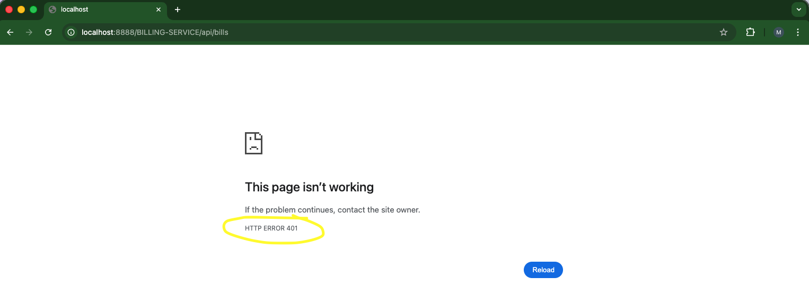

**Accès refusé sur Postman :**
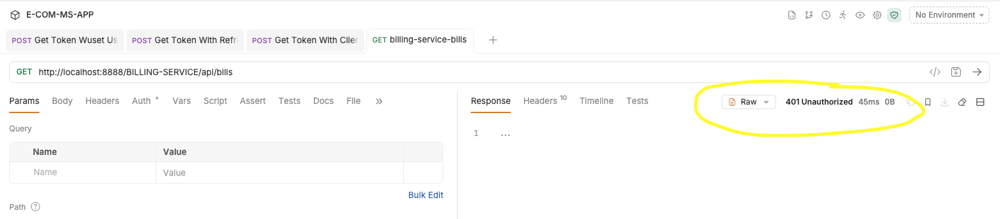

**Étape 1 — Générer un Access Token depuis Keycloak :**


**Étape 2 — Utiliser le token dans l'en-tête `Authorization: Bearer` :**
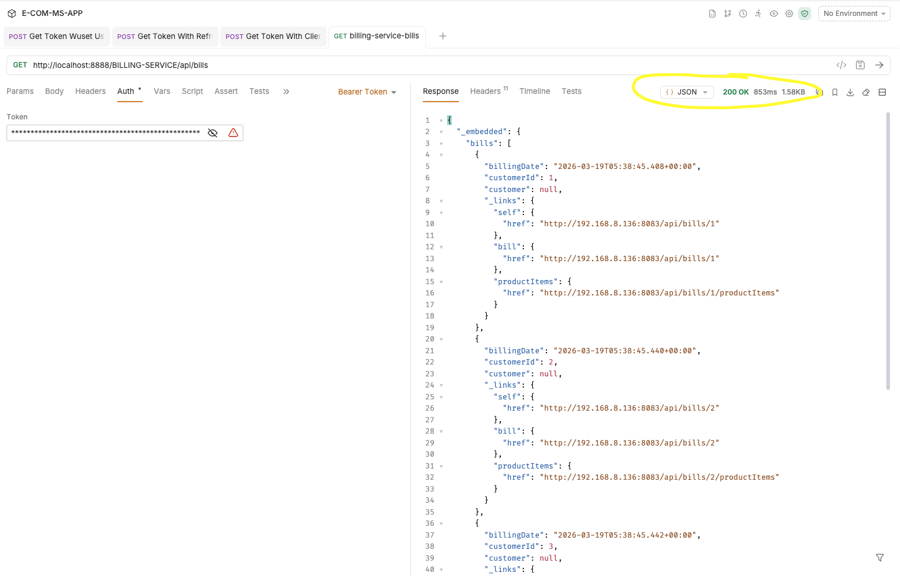

---

## 9. Frontend Angular

### 9.1 Création du projet

```shell
ng new ecom-frontend   # TailwindCSS sélectionné lors de la génération
cd ecom-frontend
ng serve
```

Application accessible sur `http://localhost:4200` :

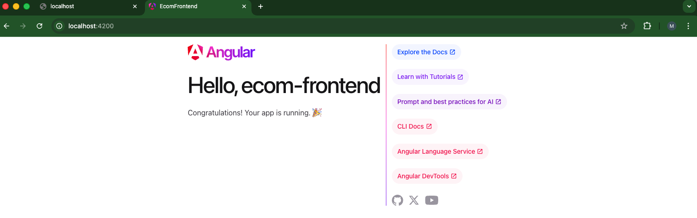

---

### 9.2 Intégration de Keycloak dans Angular

#### Installation de la librairie

```shell
npm i keycloak-angular
```

La librairie `keycloak-angular` (v21) enveloppe le SDK officiel Keycloak JS pour l'intégrer nativement dans le cycle de vie Angular.

#### Configuration dans `app.config.ts`

L'initialisation de Keycloak se fait via un `APP_INITIALIZER` qui charge la session avant le rendu de l'application :

```typescript
export const appConfig: ApplicationConfig = {
  providers: [
    provideRouter(routes),
    {
      provide: APP_INITIALIZER,
      useFactory: (keycloak: KeycloakService) => () =>
        keycloak.init({
          config: {
            url: 'http://localhost:9997',
            realm: 'ecom-ms-realm',
            clientId: 'ecom-frontend-app',
          },
          initOptions: { onLoad: 'check-sso' },
        }),
      deps: [KeycloakService],
      multi: true,
    },
    KeycloakService,
  ],
};
```

#### Garde d'authentification `auth.guard.ts`

Les routes protégées sont sécurisées via un `CanActivate` qui redirige vers Keycloak si l'utilisateur n'est pas authentifié :

```typescript
export const authGuard: CanActivateFn = () => {
  const keycloak = inject(KeycloakService);
  if (keycloak.isLoggedIn()) return true;
  keycloak.login();
  return false;
};
```

---

### 9.3 Configuration du Client Keycloak pour le Frontend

Dans la console Keycloak, créer un client `ecom-frontend-app` avec les paramètres suivants :

| Champ                   | Valeur                    |
|-------------------------|---------------------------|
| **Root URL**            | `http://localhost:4200`   |
| **Valid Redirect URIs** | `http://localhost:4200/*` |
| **Web Origins**         | `http://localhost:4200`   |

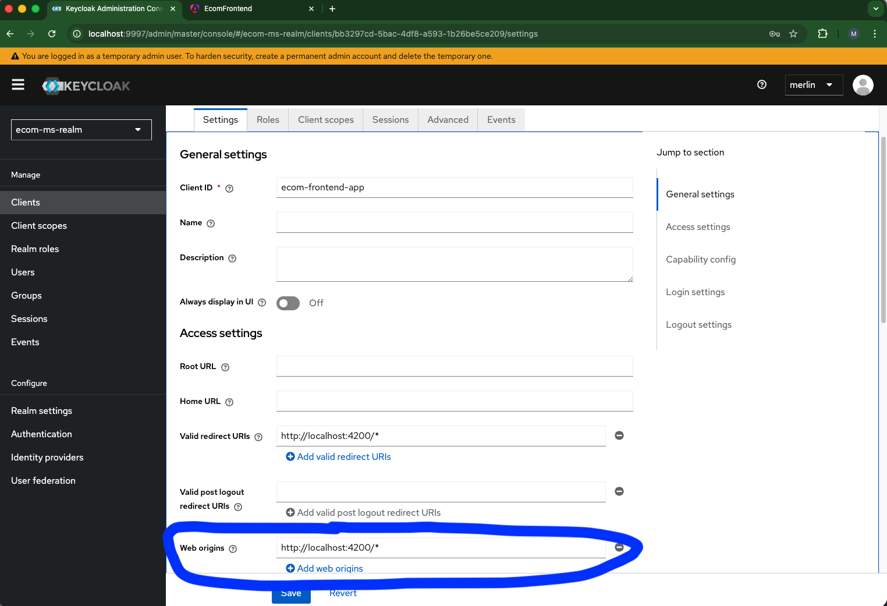

> **Web Origins** est indispensable : c'est ce champ qui autorise Keycloak à répondre aux requêtes CORS depuis l'application Angular (appels aux endpoints `/token`, `/userinfo`, etc.). Sans ce champ, les appels d'initialisation Keycloak échouent silencieusement avec une erreur CORS, même si le Realm et le Client sont correctement configurés.

Il est également possible d'activer l'auto-inscription des utilisateurs :

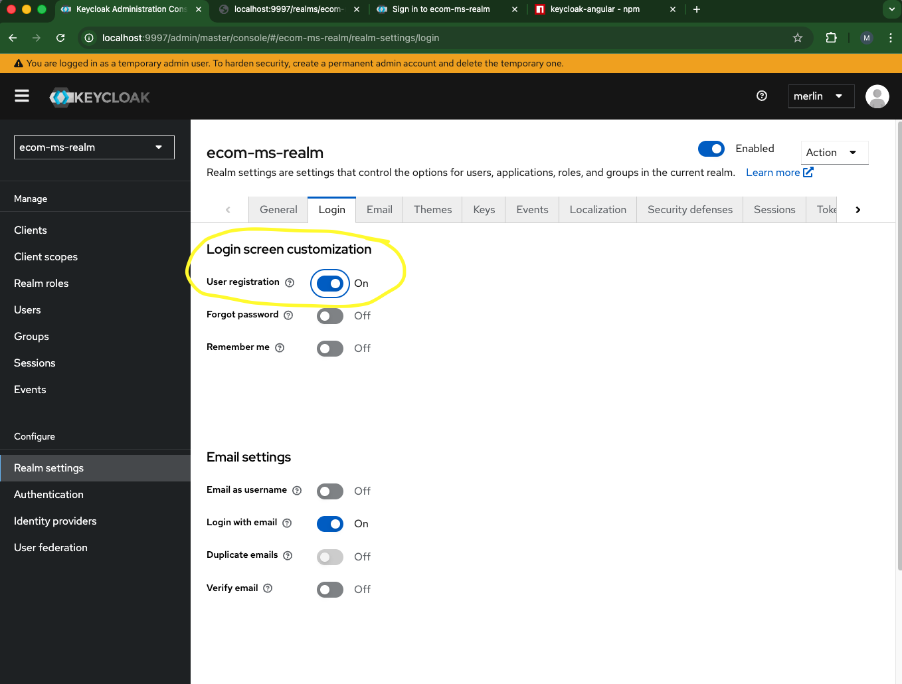

---

### 9.4 Parcours utilisateur

**Page d'accueil** (avant connexion) :

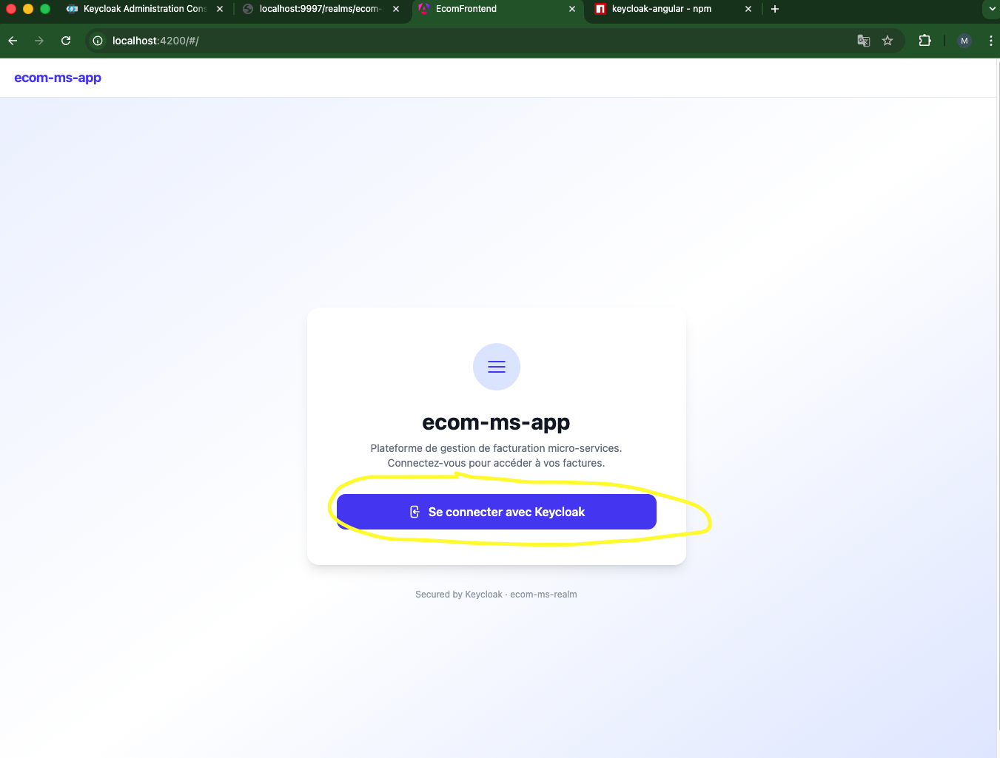

**Cliquer sur "Se connecter avec Keycloak"** — la page de login Keycloak s'affiche.
Utiliser les identifiants configurés (`user1@gmail.com` / `12345`) :

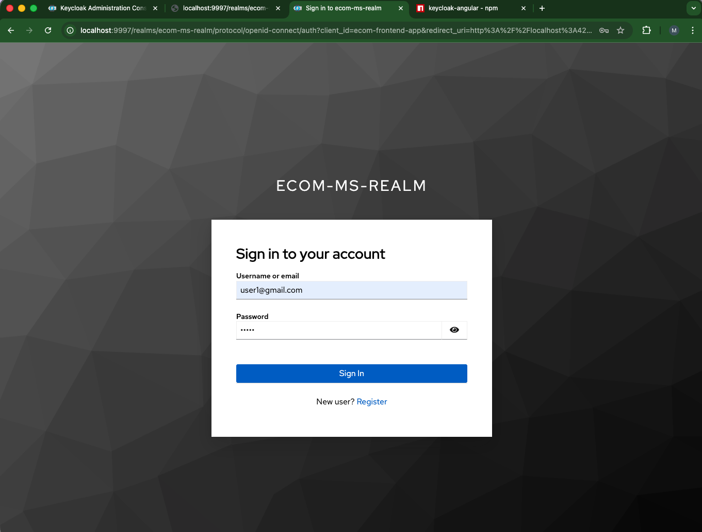

**Après connexion** — l'utilisateur connecté est affiché :

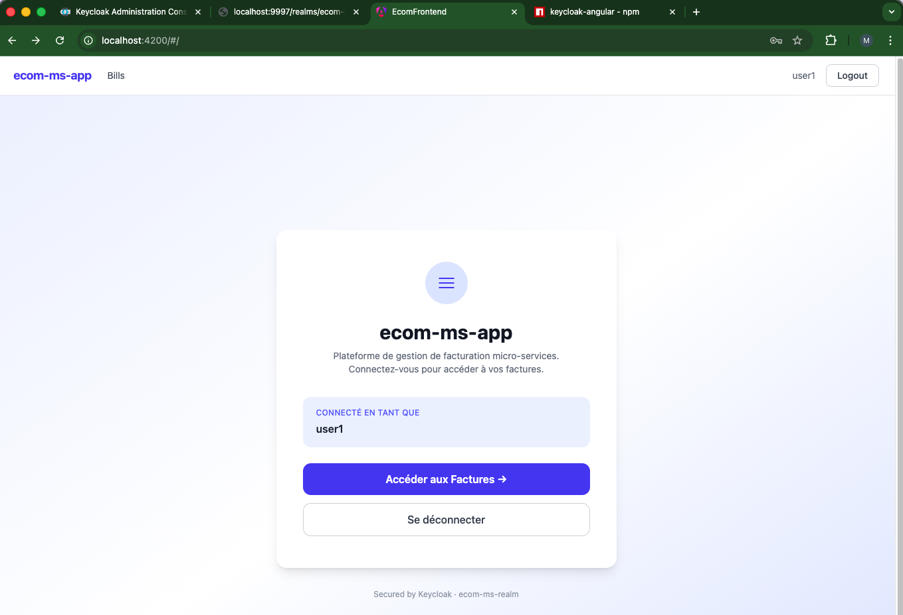

**Accès sécurisé aux factures :**

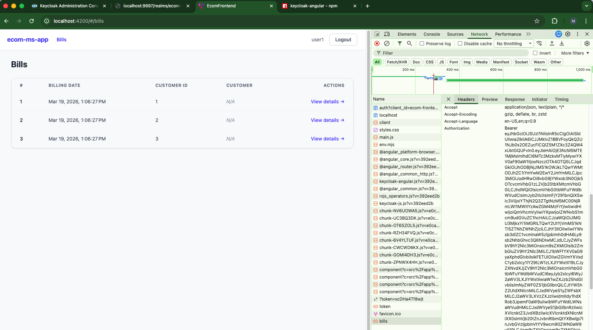

**Détail d'une facture :**

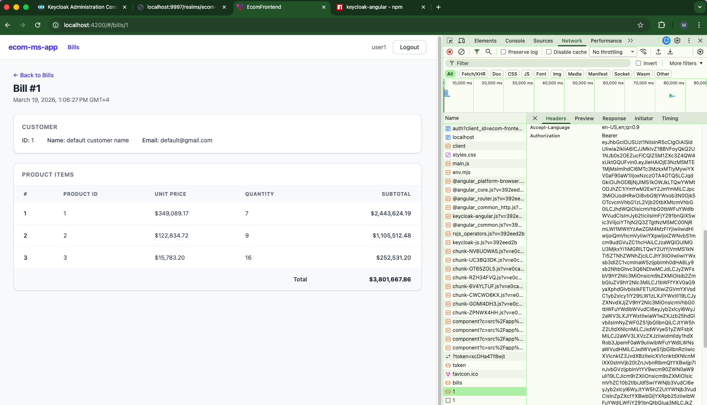

---

## 10. Prochaines Étapes : RBAC et Évolutions

### 10.1 Contrôle d'accès par rôles (RBAC)

La prochaine évolution consiste à restreindre l'accès aux ressources en fonction des **rôles** de l'utilisateur. Keycloak et Spring Security permettent un contrôle granulaire : par exemple, seul un utilisateur ayant le rôle `ROLE_ADMIN` peut créer ou supprimer des ressources, tandis que `ROLE_USER` accède uniquement en lecture.

**Côté Spring Boot** — restriction au niveau des endpoints :

```java
@Bean
public SecurityFilterChain securityFilterChain(HttpSecurity http) throws Exception {
    http.authorizeHttpRequests(auth -> auth
        .requestMatchers(HttpMethod.GET, "/api/bills/**").hasRole("USER")
        .requestMatchers(HttpMethod.POST, "/api/bills/**").hasRole("ADMIN")
        .requestMatchers(HttpMethod.DELETE, "/api/bills/**").hasRole("ADMIN")
        .anyRequest().authenticated()
    );
    // ...
}
```

**Côté Angular** — affichage conditionnel selon les rôles :

```typescript
// Dans un composant Angular
isAdmin(): boolean {
  return this.keycloak.isUserInRole('ADMIN');
}
```

Cette approche est déjà mise en œuvre dans le projet monolithique de référence :
[e-banking-backend — Contrôle d'accès par rôles](https://github.com/devsahamerlin/e-banking-backend)

---

### 10.2 Évolutions architecturales possibles

| Évolution                          | Bénéfice attendu                                                       |
|------------------------------------|------------------------------------------------------------------------|
| Communication asynchrone (Kafka)   | Éliminer le couplage temporel entre services, résilience structurelle  |
| Base de données PostgreSQL          | Persistance des données entre redémarrages, prête pour la production   |
| Conteneurisation des services       | Déploiement reproductible, intégration dans un pipeline CI/CD          |
| Observabilité (Zipkin, Prometheus)  | Traces distribuées, métriques de latence et de disponibilité           |
| Tests d'intégration automatisés     | Valider les contrats inter-services (Consumer-Driven Contract Testing)  |

---

## 11. Retours d'Expérience (Lessons Learned)

> Cette section documente les problèmes **réellement rencontrés** pendant le développement et leurs solutions. Ces situations ne se trouvent pas dans les tutoriels officiels — elles viennent du terrain.

---

### 11.1 Le bug CORS le plus trompeur : HTTP 200 avec erreur navigateur

**Symptôme :** L'onglet "Network" des DevTools affiche un statut `200 OK` pour la requête `GET /BILLING-SERVICE/api/bills`. L'onglet "Preview" est vide. La console affiche `CORS error`. Postman avec le même token retourne les données correctement.

**Cause racine :** Les services en aval avaient leur propre configuration CORS en plus de celle de la Gateway. Le header `Access-Control-Allow-Origin` était donc présent **deux fois** dans la réponse HTTP. La RFC CORS interdit les valeurs multiples pour cet en-tête — le navigateur rejette la réponse même si chaque valeur est correcte.

**Ce qui rend ce bug difficile à diagnostiquer :**
- Le statut HTTP est `200 OK` — la requête a abouti côté serveur.
- Postman ne reproduit pas le bug — ce n'est pas un problème de token ou de droits.
- L'en-tête dupliqué n'est visible qu'en inspectant les en-têtes bruts de la réponse dans les DevTools.

**Solution :** `cors.disable()` dans la `SecurityConfig` de chaque service en aval.

---

### 11.2 `KC_PROXY_HEADERS` sans reverse proxy réel casse silencieusement les CORS Keycloak

**Symptôme :** Les appels d'initialisation Keycloak depuis Angular échouent avec une erreur CORS. Keycloak renvoie une `issuer` différente de celle attendue par les services Spring Boot, causant des échecs de validation JWT.

**Cause racine :** La variable d'environnement `KC_PROXY_HEADERS=xforwarded` était définie dans le `docker-compose.yml` sans qu'aucun reverse proxy ne soit effectivement en place pour injecter les en-têtes `X-Forwarded-*`. Keycloak génère alors une `issuer` basée sur des en-têtes vides ou incorrects.

**Ce qui aggrave le problème :**
- Un `docker-compose restart` **ne recharge pas** les variables d'environnement. Le conteneur redémarre avec le même état.
- La solution requiert `docker-compose down && docker-compose up -d` pour recréer le conteneur.

**Solution :** Supprimer `KC_PROXY_HEADERS` si aucun reverse proxy n'est présent. En développement local, `KC_HOSTNAME=localhost` et `KC_HOSTNAME_PORT=9997` suffisent.

---

### 11.3 OpenFeign sans Circuit Breaker — un choix délibéré, pas un oubli

L'appel OpenFeign vers `inventory-service` dans le `billing-service` n'est **intentionnellement pas protégé** par un Circuit Breaker. Ce choix pédagogique permet d'observer le comportement en cascade lorsqu'un service est indisponible, en contraste avec la protection mise en place sur `customer-service`. En production, tous les appels inter-services doivent être protégés.

---

### 11.4 Ordre de démarrage et enregistrement Eureka

Spring Cloud avec Eureka a une latence d'enregistrement : un service peut démarrer et être prêt à recevoir des requêtes, mais n'être visible dans le registre Eureka que 30 à 60 secondes plus tard. Si `billing-service` tente d'appeler `customer-service` via OpenFeign avant que celui-ci soit enregistré, l'appel échoue avec une `NoAvailableServiceException`.

**Bonne pratique :** toujours vérifier le tableau de bord Eureka (`http://localhost:8761`) et attendre que tous les services apparaissent dans le registre avant de lancer les premiers tests.

