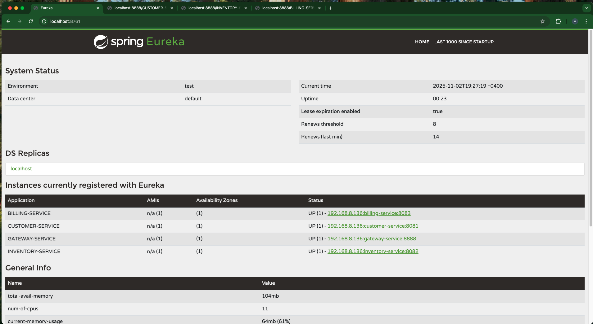
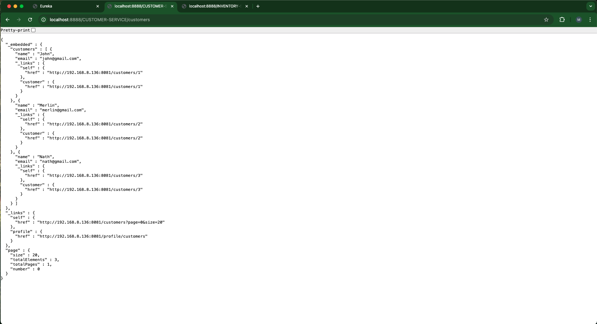
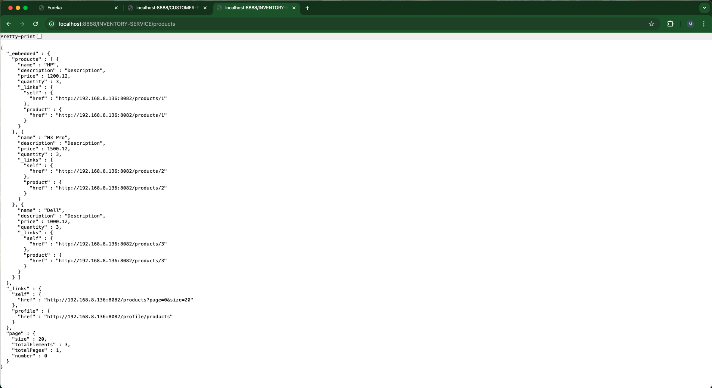
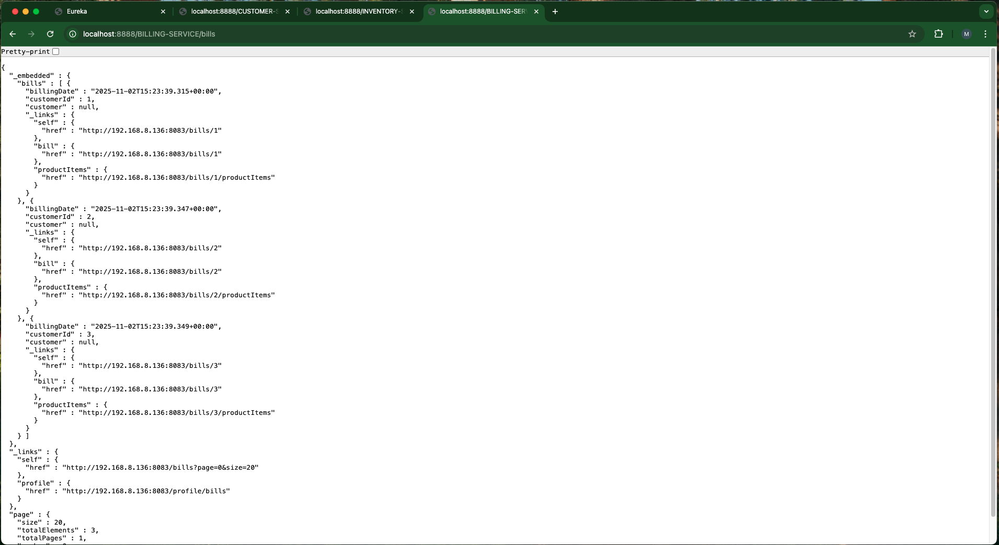
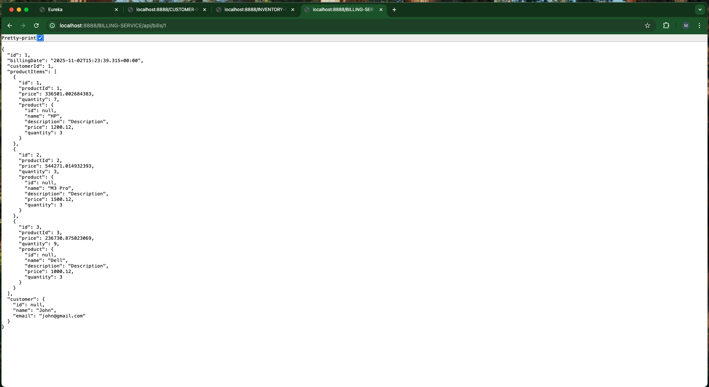
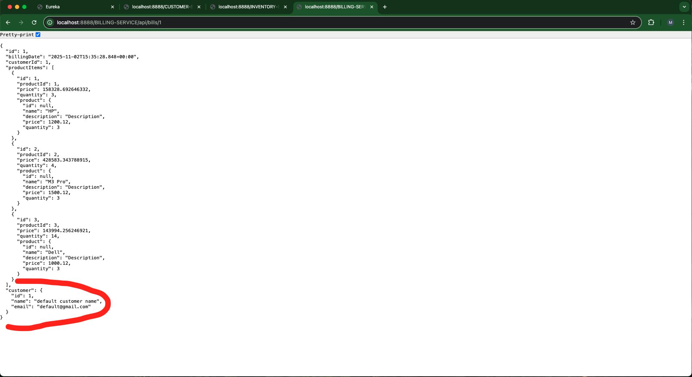
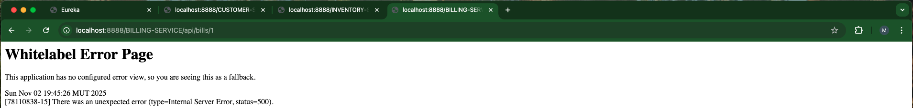

# Spring Cloud Synchronous Microservices with OpenFeign and Resilience4j Demo

This project demonstrates a **synchronous microservices architecture** built with the **Spring Cloud ecosystem**.  
It showcases how services communicate via **OpenFeign**, with **Resilience4j** providing circuit breaker capabilities for reliability.

## Architecture Overview

- **billing-service**: Orchestrates requests.
    - Calls **customer-service** synchronously to retrieve customer details.
    - Calls **inventory-service** synchronously to retrieve product details.
    - Uses **Resilience4j** circuit breakers to handle service failures gracefully.
- **customer-service**: Provides customer information.
- **inventory-service**: Provides product information.
- **discovery-service**: Handles service registration and discovery (Eureka).
- **gateway-service**: Provides API gateway and routing.
- **config-service**: Centralized configuration for all microservices. `(next step)`

## Key Features
- Built with **Spring Boot & Spring Cloud**
- **OpenFeign** for synchronous service-to-service communication
- **Resilience4j** for fault tolerance (circuit breaker, retry)
- **Eureka Discovery Service**
- **Spring Cloud Gateway**
- **Spring Cloud Config Server `(next step)`**
- **Dockerized` (to be done)`** for easy local setup and testing

## Application testing

- http://localhost:8761

- http://localhost:8888/CUSTOMER-SERVICE/customers

- http://localhost:8888/INVENTORY-SERVICE/products

- http://localhost:8888/BILLING-SERVICE/bills

- http://localhost:8888/BILLING-SERVICE/api/bills/1

- Customer service down with circuit breaker default method

- Inventory service down without circuit breaker

