# Documentation Keycloak

Cette documentation détaille la mise en place, la configuration et la validation du service de gestion des identités Keycloak.

## 1. Déploiement et Initialisation

L'infrastructure micro-services nécessite un service centralisé pour la gestion des identités et des accès (IAM). Pour déployer une instance Keycloak de manière automatisée et reproductible, l'orchestrateur Docker Compose est utilisé.

Exécuter les commandes suivantes dans le dossier `infra` :
```shell
cd infra
docker-compose -f common.yml -f keycloak.yml up -d
```

Une fois le service démarré, l'interface est accessible via `http://localhost:9997`. La configuration initiale requiert la définition des identifiants administrateur, soit par les variables d'environnement (en copiant `.env.example` vers `.env`) ou via la page d'accueil au premier lancement.

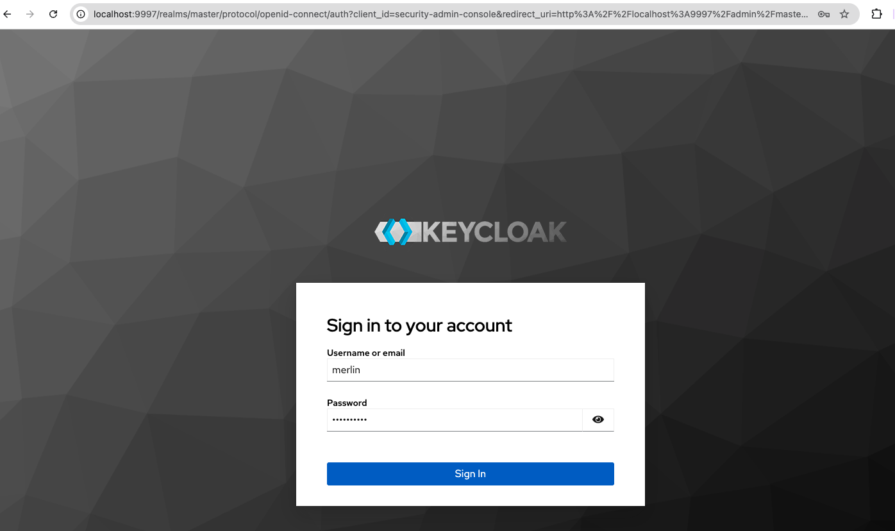

---

## 2. Gestion des Royaumes (Realms)

Keycloak utilise la notion de "Realm" (Royaume) pour isoler les configurations (clients, rôles, utilisateurs) de différents tenants ou environnements. Le royaume par défaut "Master" étant réservé à l'administration du serveur, il ne doit pas héberger les configurations applicatives. Il est donc nécessaire de créer un nouveau Realm dédié au projet (ex: `ecom-ms-app`) via la console d'administration.

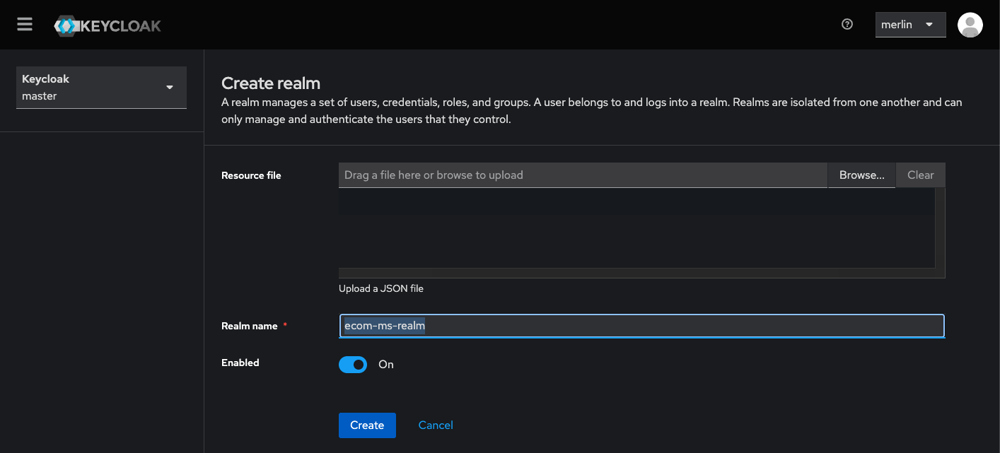

---

## 3. Enregistrement des Applications (Clients)

Pour déléguer l'authentification à Keycloak, l'application cliente doit être reconnue et autorisée à interagir avec le service d'authentification. Cela implique la création d'un nouveau "Client" (ex: `ecom-frontend-app`) en conservant les paramètres par défaut.

### Configuration obligatoire pour éviter les erreurs CORS

Lorsqu'une application Angular (SPA) appelle directement les endpoints Keycloak (`/token`, `/userinfo`, etc.), le navigateur envoie une requête `OPTIONS` (preflight). Si Keycloak ne reconnaît pas l'origine de la requête, il rejette la connexion avec l'erreur :

```
Access to fetch at 'http://localhost:9997/.../token' from origin 'http://localhost:4200'
has been blocked by CORS policy: No 'Access-Control-Allow-Origin' header is present.
```

Les trois champs suivants doivent **tous** être renseignés dans la console Keycloak, onglet **Settings** du client :

| Champ | Valeur requise | Effet |
|---|---|---|
| **Root URL** | `http://localhost:4200` | URL de base de l'application |
| **Valid Redirect URIs** | `http://localhost:4200/*` | URLs autorisées après login/logout |
| **Web Origins** | `http://localhost:4200` | Autorise les requêtes CORS depuis cette origine |

> **Attention** : Mettre `+` dans **Web Origins** autorise toutes les `Valid Redirect URIs` comme origines CORS. Mettre `*` autorise toutes les origines (déconseillé en production).

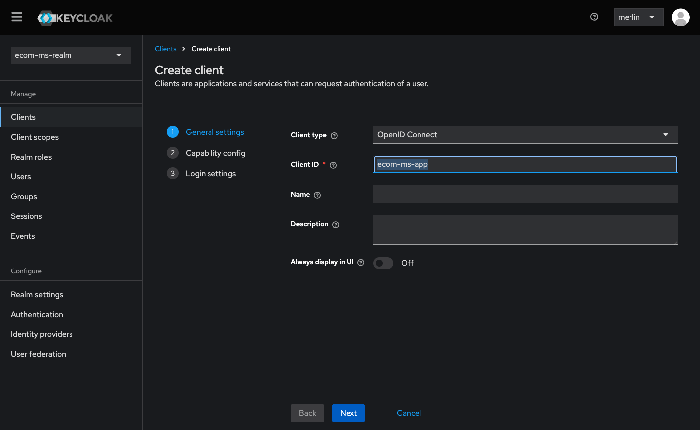
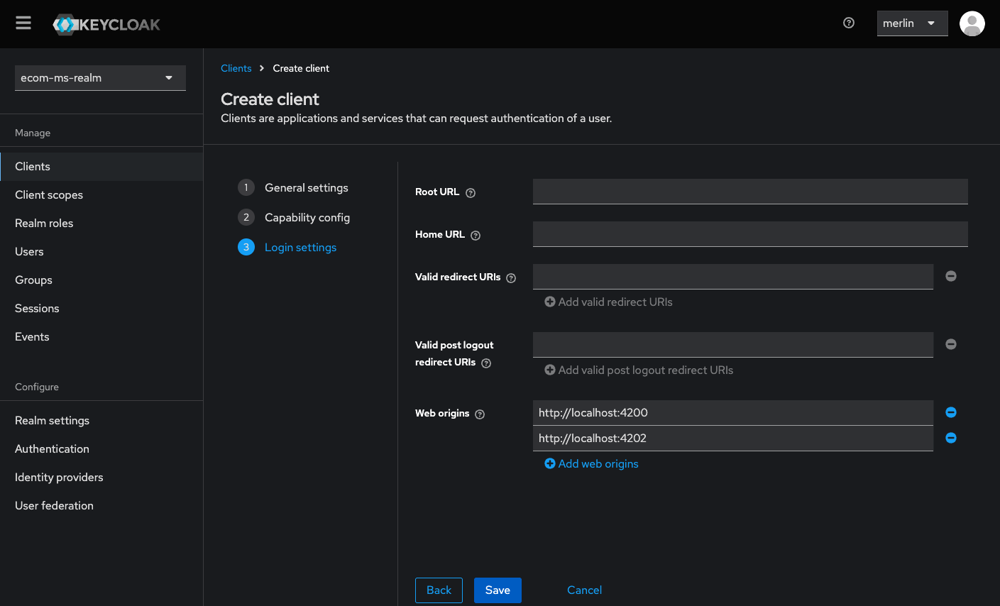

### Type de client pour une SPA Angular

Le client Angular doit être de type **Public** (pas de secret client) avec les paramètres suivants :

| Paramètre | Valeur |
|---|---|
| **Client authentication** | `OFF` (public client) |
| **Standard flow** | `ON` (Authorization Code Flow) |
| **Direct access grants** | `OFF` (désactivé pour les SPA) |

---

## 4. Modélisation des Rôles (RBAC)

La sécurité applicative repose sur une gestion des droits basée sur les rôles (RBAC - Role Based Access Control). Pour définir une structure de permissions claire et hiérarchisée, des rôles sont créés au niveau du Realm (Realm Roles) via l'onglet dédié (ex: `admin`, `user`). L'utilisation de rôles composites permet ensuite de grouper plusieurs permissions sous un même rôle fonctionnel (Associate Role).

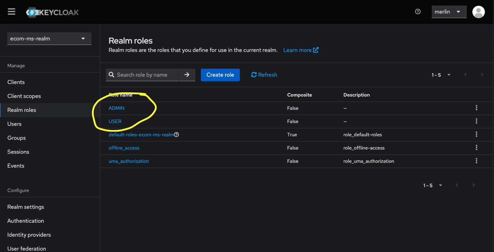
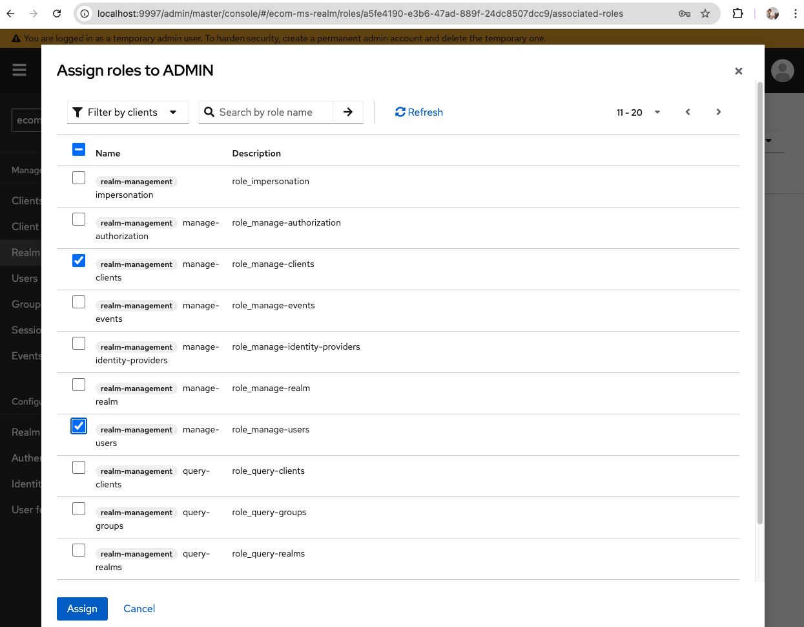
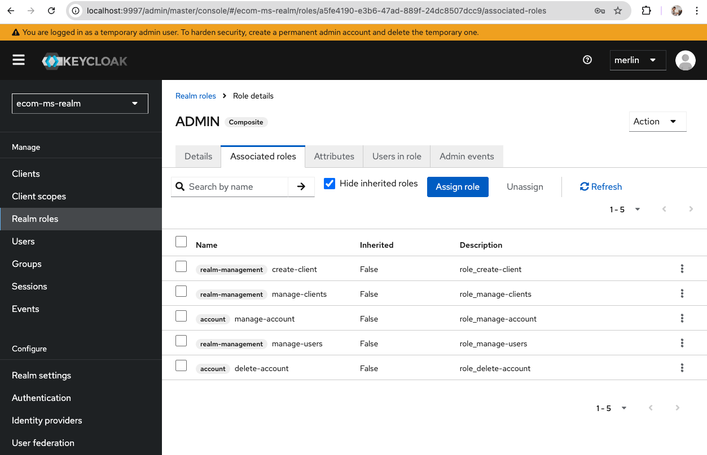

---

## 5. Gestion des Utilisateurs

Les utilisateurs finaux doivent disposer d'un compte pour accéder aux applications. La création d'identités numériques s'effectue via le menu "Users". Une fois l'utilisateur créé, ses identifiants de connexion (mot de passe) doivent être définis via l'onglet "Credentials" pour sécuriser l'accès.

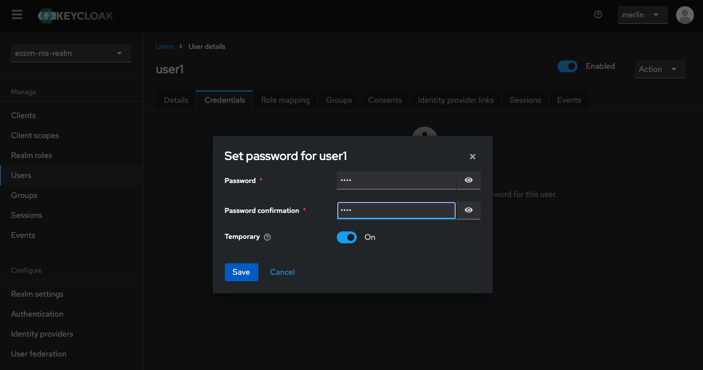

---

## 6. Assignation des Droits

Un utilisateur nouvellement créé ne dispose par défaut d'aucun privilège spécifique. Pour l'associer aux permissions définies, il est nécessaire d'utiliser le "Role Mapping" dans la fiche utilisateur. L'opération consiste à filtrer pour afficher les "Realm Roles", sélectionner les rôles souhaités (ex: `admin`) et les assigner via le bouton "Add selected".

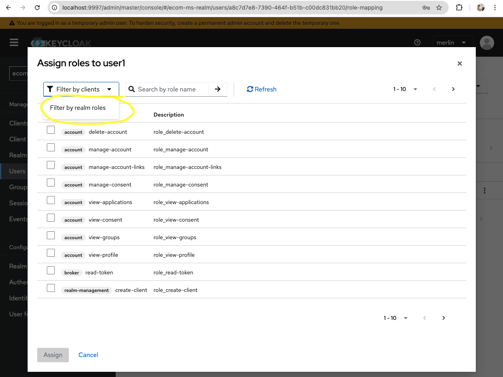
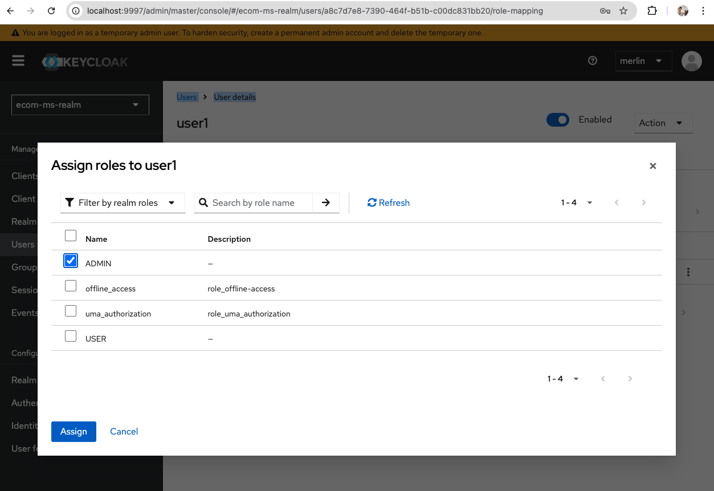

---

## 7. Validation et Exploitation (Testing)

Avant intégration, la validation du bon fonctionnement des flux d'authentification (OIDC) est critique pour vérifier l'émission et la validité des jetons d'accès (Tokens). L'utilisation d'un outil comme Postman permet de simuler ces requêtes.

**Récupération de la configuration :**
Accéder à `Realm Settings > Endpoints > OpenID Endpoint Configuration` permet d'obtenir les URLs nécessaires, notamment le `token_endpoint`.

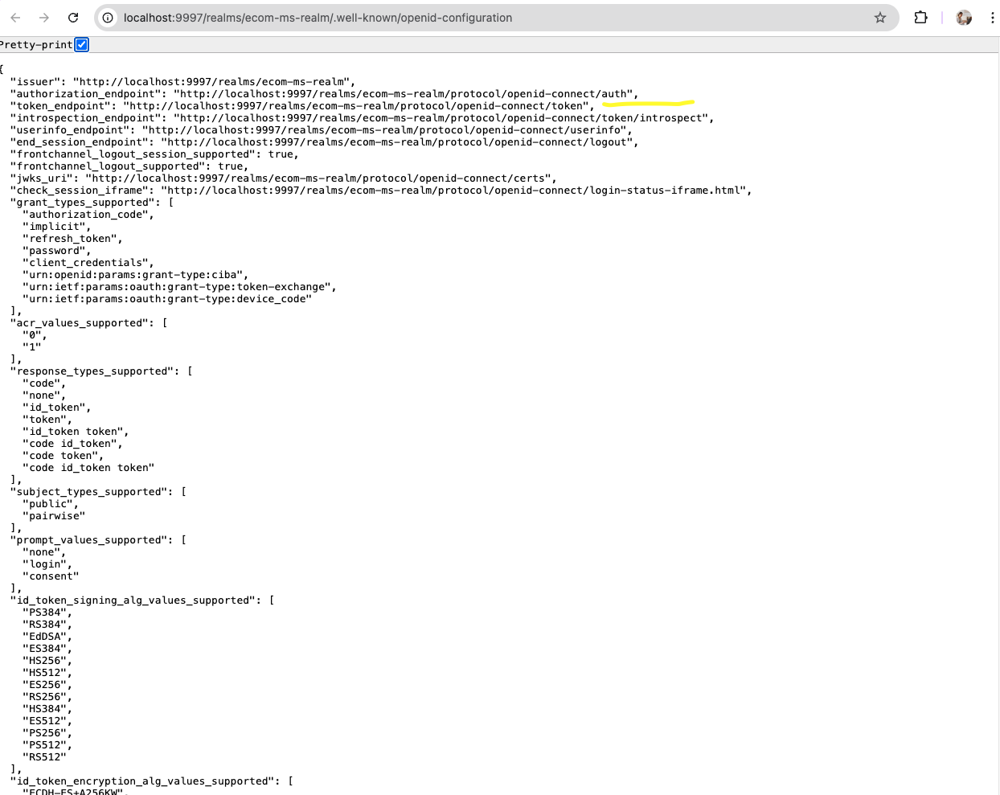

**Test du flux "Password Grant" :**
Une requête POST vers le `token_endpoint` avec le login et le mot de passe utilisateur permet de vérifier l'obtention du token.

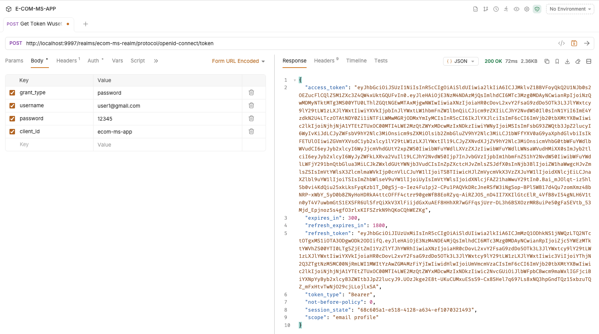

**Analyse du Token :**
Le contenu du JWT (Access Token et Refresh Token) doit être vérifié via un décodeur (ex: jwt.io ou inspection interne).

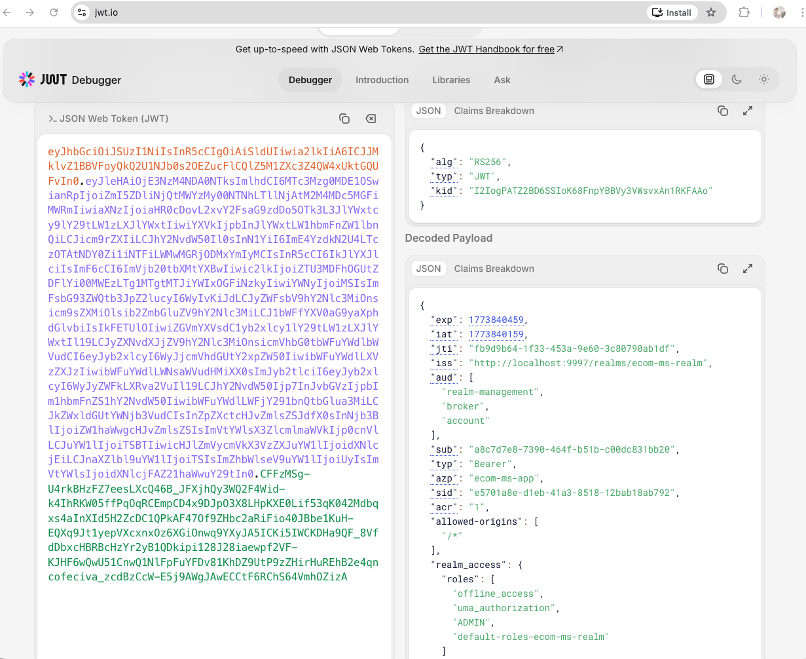

**Test du "Refresh Token" :**
Le Refresh Token est utilisé pour obtenir un nouvel Access Token sans ressaisir les identifiants, validant ainsi le mécanisme de rafraîchissement de session.

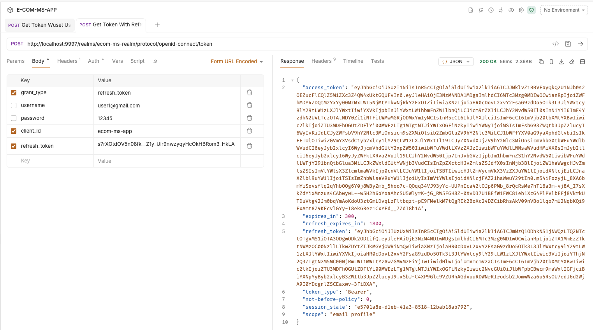

**Test "Client Credentials" :**
(Pour les services backend)
Pour valider l'authentification de service à service :
1. Activer "Client authentication" dans les paramètres du client Keycloak.
2. Récupérer le "Client Secret" dans l'onglet Credentials.
3. Tester l'authentification avec le couple Client ID / Client Secret.

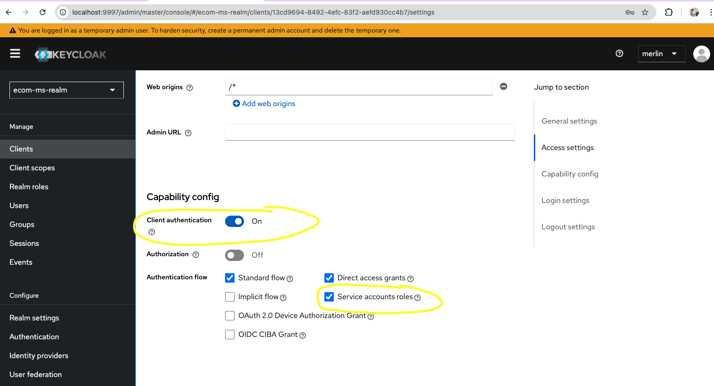
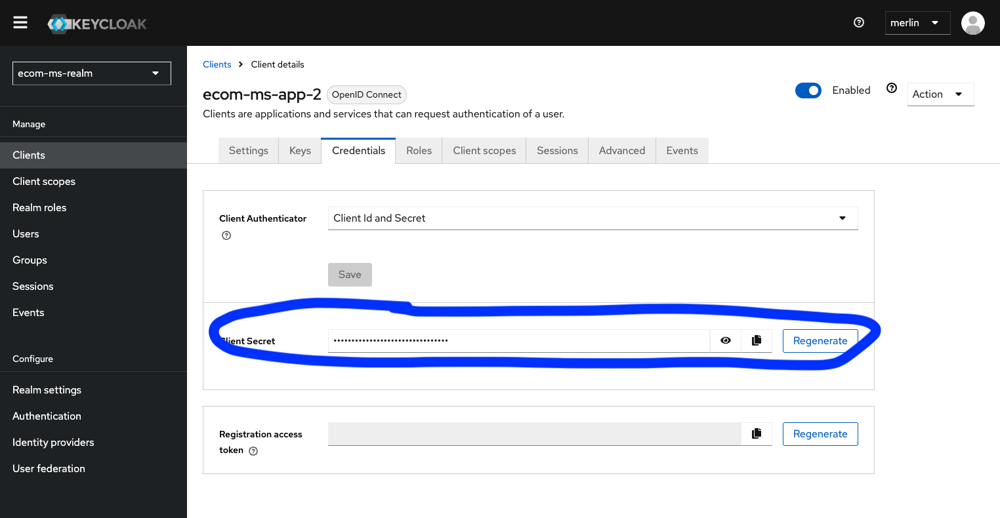
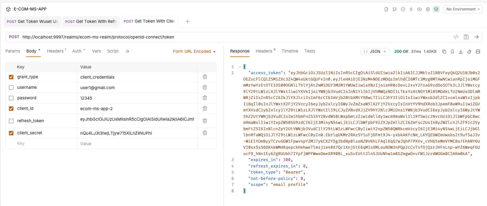
## 8. Résolution des problèmes courants

### Erreur CORS sur le token endpoint

Une erreur du type suivant peut apparaître lors de l'initialisation de Keycloak depuis une SPA Angular :

```
Access to fetch at 'http://localhost:9997/realms/.../token' from origin 'http://localhost:4200'
has been blocked by CORS policy: No 'Access-Control-Allow-Origin' header is present.
POST http://localhost:9997/.../token net::ERR_FAILED 200 (OK)
```

Le code HTTP `200 (OK)` combiné à l'erreur CORS indique que **la requête aboutit côté serveur, mais le navigateur bloque la réponse** faute du header `Access-Control-Allow-Origin`. La cause n'est pas dans Angular.

Deux causes fréquentes dans la configuration Keycloak :

| Variable | Mauvaise valeur | Effet |
|---|---|---|
| `KC_PROXY_HEADERS=xforwarded` | Présente sans reverse proxy réel | Keycloak attend des headers `X-Forwarded-*` qui n'arrivent jamais, il ne peut pas déterminer l'origine correcte pour répondre aux CORS |
| `KC_HOSTNAME` | Absente | Sans hostname explicite, Keycloak ne sait pas construire les URLs de ses réponses CORS |

La configuration correcte pour un environnement local sans reverse proxy est la suivante dans `keycloak.yml` :

```yaml
- KC_HTTP_PORT=9997
- KC_HTTP_ENABLED=true
- KC_HOSTNAME=localhost
- KC_HOSTNAME_PORT=9997
- KC_HOSTNAME_STRICT=false
- KC_HOSTNAME_STRICT_HTTPS=false
- KC_FEATURES=token-exchange
```

Après modification du fichier, le conteneur doit être redémarré :

```shell
cd infra
docker-compose -f common.yml -f keycloak.yml down
docker-compose -f common.yml -f keycloak.yml up -d
```

> **Note** : La modification des variables d'environnement Keycloak ne suffit pas — un redémarrage complet du conteneur est nécessaire pour les appliquer.

